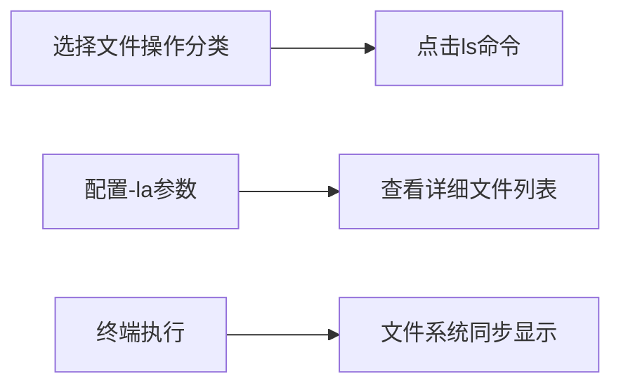
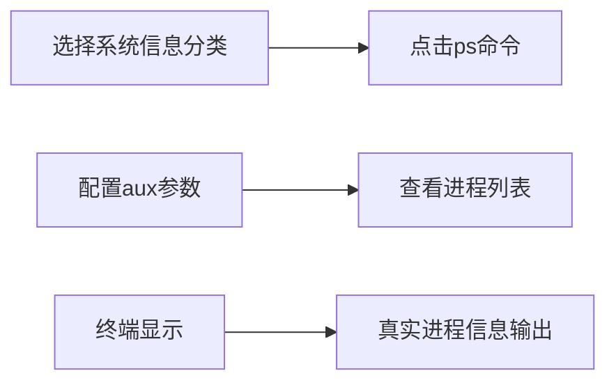
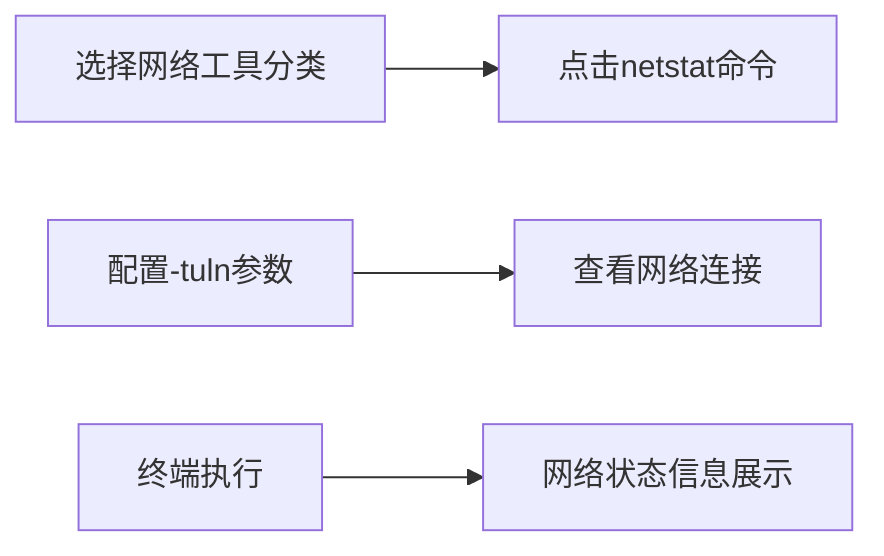

# 🐧 LinuxDojo - Linux命令学习道场

<p align="center">
  
  
  
  
  
</p>

> 交互式Linux命令学习平台，通过真实的终端体验和智能文件系统，让Linux学习变得简单有趣

**LinuxDojo** 是一个现代化的 Linux 命令学习平台，采用 Vue 3 构建，提供 Mac 风格的终端界面和完整的 Linux 文件系统模拟。通过真实的命令输出和智能的文件关联展示，帮助初学者和进阶用户掌握 Linux 命令行技能。


<br/>

## ✨ 核心功能

- **🖥️ 真实终端体验**：Mac 风格界面，支持 90+ 常用命令，具备历史记录、自动补全和语法高亮功能
- **📁 智能文件系统**：模拟完整的 Linux 目录结构 (/home, /etc, /var 等)，支持权限管理和文件操作
- **⚡ 学习增强**：提供分类命令导航、可视化参数构建器和实时结果展示
- **📊 系统集成**：实时显示内存、磁盘使用、系统负载等系统信息
- **🎨 现代化设计**：响应式布局，完美适配桌面和移动设备，支持分割式视图
- **🔍 深度模拟**：支持管道、重定向（规划中）以及复杂的文本处理命令 (sed, awk, grep)

<br/>

## 🚀 快速开始

### 环境要求
- Node.js 16.0+
- npm 7.0+ 或 yarn 1.22+

### 安装步骤
```bash
# 克隆仓库
git clone https://github.com/Ouniel/linuxdojo.git

# 进入项目目录
cd linuxdojo

# 安装依赖
npm install

# 启动开发服务器
npm run dev

# 构建生产版本
npm run build
```

访问 `http://localhost:5173` 开始您的 Linux 学习之旅！

<br/>

## 🖥️ 界面导览

### 主界面布局

1. **左侧导航栏**：命令分类和学习路径
2. **中央参数区**：可视化命令参数配置
3. **右上文件区**：智能文件系统展示
4. **右下终端区**：Mac 风格真实终端

### 终端界面特色
- **Mac 风格设计**：红绿黄按钮，毛玻璃标题栏
- **用户提示符**：`favork@linux:~$` 真实 Linux 提示符
- **交互体验**：Tab 键自动补全，上下箭头历史导航

<br/>

## 🛠️ 使用示例

### 场景1：学习文件操作命令


### 场景2：系统信息查看


### 场景3：网络命令学习


<br/>

## 💡 支持的命令分类

### 基础命令表
| 命令类别 | 主要命令 | 功能描述 |
|----------|----------|----------|
| **文件操作** | `ls`, `cat`, `cp`, `mv`, `rm`, `touch`, `ln` | 文件和目录的基本操作 |
| **目录管理** | `cd`, `pwd`, `mkdir`, `rmdir` | 目录导航和管理 |
| **文本处理** | `grep`, `egrep`, `fgrep`, `sed`, `awk`, `sort`, `uniq`, `cut`, `tr`, `wc`, `diff`, `comm`, `join`, `paste`, `split` | 文本搜索、编辑和处理 |
| **系统信息** | `ps`, `top`, `htop`, `free`, `df`, `du`, `uname`, `uptime`, `mount`, `umount` | 系统状态和进程监控 |
| **网络工具** | `ping`, `curl`, `wget`, `netstat`, `ss`, `traceroute`, `dig`, `host`, `ssh`, `scp`, `ftp`, `telnet`, `nc`, `iptables`, `ip`, `ifconfig`, `rsync` | 网络连接和数据传输 |
| **权限管理** | `chmod`, `chown`, `sudo`, `su`, `umask` | 文件权限和用户管理 |
| **压缩解压** | `tar`, `zip`, `unzip`, `gzip`, `gunzip` | 文件压缩和解压缩 |
| **查找定位** | `find`, `which`, `whereis` | 文件和命令查找 |
| **进程管理** | `kill`, `killall`, `pkill`, `pgrep`, `jobs`, `bg`, `fg` | 进程控制和作业管理 |
| **磁盘管理** | `fdisk`, `parted`, `mkfs`, `fsck` | 磁盘分区和文件系统管理 |
| **软件包管理** | `apt`, `yum` | 软件包安装和管理 |

### 命令学习路径
1. **新手入门**：基础导航 (`pwd`, `ls`) -> 文件操作 (`cp`, `mv`, `touch`) -> 目录管理 (`mkdir`, `cd`)
2. **进阶使用**：文本处理 (`grep`, `sed`, `awk`) -> 系统监控 (`ps`, `top`, `htop`) -> 网络诊断 (`ping`, `netstat`, `traceroute`)
3. **高级技巧**：权限管理 (`chmod`, `chown`, `sudo`) -> 进程控制 (`kill`, `jobs`, `bg`, `fg`) -> 磁盘管理 (`fdisk`, `mount`) -> 系统管理

<br/>

## 🔧 技术特性

### 核心架构
- **Vue 3 + Composition API**：构建响应式用户界面
- **Pinia 状态管理**：管理文件系统状态、命令历史和用户配置
- **Vite 构建工具**：提供极速的开发体验和构建性能
- **Tailwind CSS**：打造现代化的 UI 设计

### 模块化设计
- **终端模拟器** (`MacTerminal.vue`)：完整的终端交互逻辑实现
- **文件系统核心** (`filesystem.js`)：基于内存的虚拟文件系统树
- **命令注册表** (`commandRegistry.js`)：可扩展的命令插件系统
- **可视化组件**：针对特定命令 (如 iptables, netstat) 的图形化展示

### 项目结构
```
LinuxDojo/
├── src/
│   ├── assets/              # 静态资源
│   ├── components/          # UI组件
│   │   ├── EnhancedTerminal.vue    # 增强终端
│   │   ├── FileSystemVisualizer.vue # 文件系统可视化
│   │   ├── MacTerminal.vue         # Mac风格终端
│   │   ├── CommandPanel.vue        # 命令面板
│   │   ├── CommandParameterBuilder.vue # 参数构建器
│   │   └── ...
│   ├── core/               # 核心逻辑
│   │   ├── EnhancedCommandProcessor.js # 命令处理器
│   │   └── VirtualFileSystem.js      # 虚拟文件系统
│   ├── stores/             # Pinia状态管理
│   │   ├── filesystem.js   # 文件系统状态
│   │   ├── commands.js     # 命令状态管理
│   │   ├── ui.js           # UI状态管理
│   │   └── modules/        # 命令实现模块
│   │       ├── basic/      # 基础命令 (31个)
│   │       ├── system/     # 系统命令 (10个+)
│   │       ├── network/    # 网络命令 (17个)
│   │       ├── text/       # 文本处理命令 (12个+)
│   │       ├── file/       # 文件操作命令 (5个)
│   │       ├── permission/ # 权限管理命令 (3个)
│   │       ├── process/    # 进程管理命令 (7个+)
│   │       ├── disk/       # 磁盘管理命令 (4个)
│   │       ├── package/    # 软件包管理命令 (2个)
│   │       ├── help.js     # 帮助命令
│   │       └── commandRegistry.js # 命令注册表
│   ├── utils/              # 工具函数
│   └── views/              # 页面视图
│       └── HomeView.vue    # 主页面
├── public/                 # 公共资源
├── scripts/                # 项目脚本
│   └── countCommands.js    # 命令统计脚本
└── index.html              # 入口文件
```

<br/>

## 🤝 贡献指南

我们欢迎所有形式的贡献！无论是新功能、bug 修复、文档改进还是设计建议。

### 开发流程
1. Fork 本仓库
2. 创建特性分支 (`git checkout -b feature/AmazingFeature`)
3. 提交更改 (`git commit -m 'Add some AmazingFeature'`)
4. 推送到分支 (`git push origin feature/AmazingFeature`)
5. 开启 Pull Request

<br/>

## 📜 许可协议

本项目采用 **MIT 许可证** - 详细信息请查看 [LICENSE](LICENSE) 文件。

---

**让 Linux 学习变得简单有趣** - 在 LinuxDojo 中掌握命令行的艺术 🐧⚡
