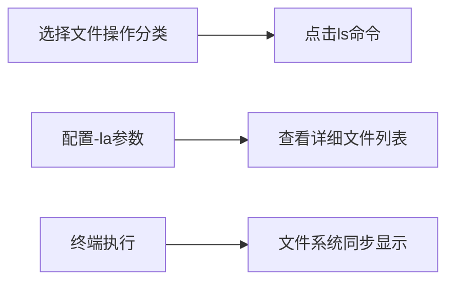
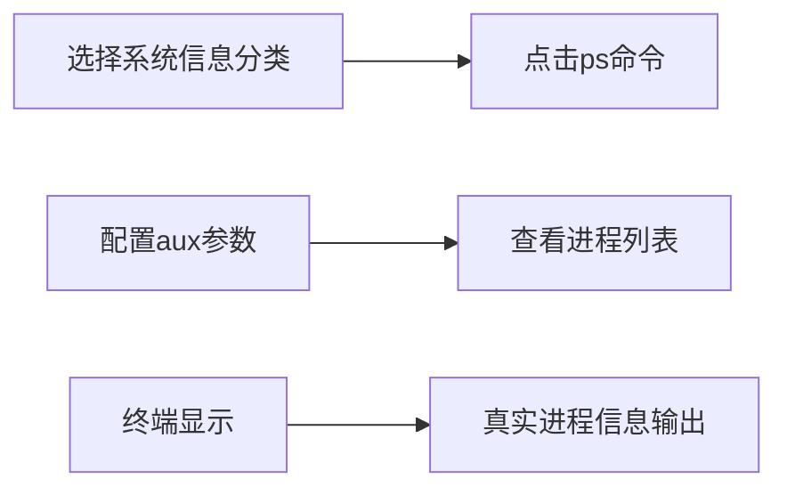
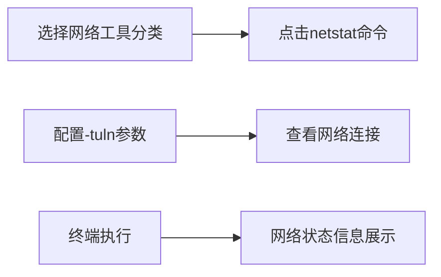
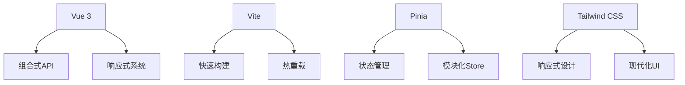

# 🐧 LinuxDojo - Linux命令学习道场

<p align="center">
  
  
  
  
</p>

> 交互式Linux命令学习平台，通过真实的终端体验和智能文件系统，让Linux学习变得简单有趣

**LinuxDojo**是一个现代化的Linux命令学习平台，采用Vue 3构建，提供Mac风格的终端界面和完整的Linux文件系统模拟。通过真实的命令输出和智能的文件关联展示，帮助初学者和进阶用户掌握Linux命令行技能。


## ✨ 核心功能

### 🖥️ 真实终端体验
- **Mac风格界面**：经典的红绿黄交通灯按钮，毛玻璃效果标题栏
- **50+Linux命令**：支持ls、cat、grep、ps、top、netstat等常用命令
- **真实输出**：命令输出完全模拟真实Linux系统行为
- **命令历史**：上下箭头导航历史命令，支持命令重复执行
- **自动补全**：Tab键触发命令和文件名自动补全
- **语法高亮**：命令输出支持颜色高亮显示

### 📁 智能文件系统
- **完整目录结构**：模拟真实的Linux文件系统（/home、/etc、/var等）
- **命令关联展示**：根据当前执行命令动态显示相关文件
- **文件操作支持**：支持文件查看、编辑、目录导航等操作
- **权限系统**：完整的Linux文件权限显示和管理
- **系统信息集成**：实时显示内存、磁盘使用、系统负载等信息

### ⚡ 学习增强功能
- **分类命令导航**：按功能分类的命令学习路径
- **参数构建器**：可视化命令参数配置
- **实时结果展示**：命令执行结果即时显示
- **分割式布局**：上下分割显示文件系统和终端
- **响应式设计**：完美适配桌面和移动设备

## 🚀 快速开始

### 环境要求
- Node.js 16.0+
- npm 7.0+ 或 yarn 1.22+

### 本地运行
```bash
# 克隆仓库
git clone https://github.com/Ouniel/linuxdojo.git

# 进入项目目录
cd linuxdojo

# 安装依赖
npm install

# 启动开发服务器
npm run dev

# 构建生产版本
npm run build
```

访问 `http://localhost:5173` 开始您的Linux学习之旅！

## 🖥️ 界面导览

### 主界面布局

1. **左侧导航栏**：命令分类和学习路径
2. **中央参数区**：可视化命令参数配置
3. **右上文件区**：智能文件系统展示
4. **右下终端区**：Mac风格真实终端

### 终端界面特色

1. **Mac风格设计**：红绿黄按钮，毛玻璃标题栏
2. **用户提示符**：favork@linux:~$ 真实Linux提示符
3. **命令补全**：Tab键自动补全命令和文件名
4. **历史导航**：上下箭头浏览命令历史
5. **语法高亮**：彩色输出增强可读性

### 文件系统展示

- **命令关联**：根据当前命令显示相关文件
- **详细信息**：文件权限、大小、修改时间
- **操作支持**：点击文件查看内容，点击目录进入
- **系统监控**：内存使用、磁盘空间、系统负载

## 🛠️ 使用示例

### 场景1：学习文件操作命令


### 场景2：系统信息查看


### 场景3：网络命令学习


## 💡 支持的命令分类

### 基础命令表
| 命令类别     | 主要命令                           | 功能描述                     |
| ------------ | ---------------------------------- | ---------------------------- |
| **文件操作** | `ls`, `cat`, `cp`, `mv`, `rm`      | 文件和目录的基本操作         |
| **目录管理** | `cd`, `pwd`, `mkdir`, `rmdir`      | 目录导航和管理               |
| **文本处理** | `grep`, `sed`, `awk`, `sort`       | 文本搜索、编辑和处理         |
| **系统信息** | `ps`, `top`, `free`, `uname`       | 系统状态和进程监控           |
| **网络工具** | `ping`, `curl`, `wget`, `netstat`  | 网络连接和数据传输           |
| **权限管理** | `chmod`, `chown`, `sudo`           | 文件权限和用户管理           |
| **压缩解压** | `tar`, `zip`, `unzip`, `gzip`      | 文件压缩和解压缩             |
| **查找定位** | `find`, `locate`, `which`, `whereis` | 文件和命令查找               |

### 命令学习路径
1. **新手入门**：
   - 基础导航：`pwd`, `ls`, `cd`
   - 文件操作：`cat`, `touch`, `cp`, `mv`
   - 目录管理：`mkdir`, `rmdir`

2. **进阶使用**：
   - 文本处理：`grep`, `sed`, `awk`
   - 系统监控：`ps`, `top`, `htop`
   - 网络诊断：`ping`, `netstat`, `ss`

3. **高级技巧**：
   - 权限管理：`chmod`, `chown`, `umask`
   - 进程控制：`kill`, `jobs`, `nohup`
   - 系统管理：`crontab`, `systemctl`

## 🧩 技术架构

### 前端技术栈


### 核心模块架构
1. **终端模拟器**：MacTerminal.vue - 完整的终端功能实现
2. **文件系统**：filesystem.js - 统一的Linux文件系统模拟
3. **命令处理**：commands.js - 50+命令的执行逻辑
4. **状态管理**：Pinia stores - 用户状态、历史记录、文件系统状态
5. **UI组件**：响应式组件库 - 分割布局、虚拟滚动、懒加载

### 核心特性实现
1. **真实命令输出**：每个命令都提供接近真实Linux系统的输出
2. **智能文件关联**：根据命令类型动态显示相关文件和目录
3. **性能优化**：虚拟滚动处理大量输出，懒加载优化组件
4. **用户体验**：Mac风格设计，流畅动画，响应式布局

## 🎯 项目特色

### 教学导向设计
- **渐进式学习**：从基础到高级的完整学习路径
- **实践导向**：真实的命令执行环境，学以致用
- **即时反馈**：命令执行结果即时显示，错误提示清晰
- **上下文关联**：文件系统与命令执行完美结合

### 技术创新点
- **统一文件系统**：所有命令共享同一个文件系统状态
- **命令智能关联**：根据命令类型动态展示相关文件
- **真实输出模拟**：告别"命令执行成功"的通用提示
- **Mac风格终端**：提供接近真实macOS终端的使用体验

## 📈 未来规划

### 短期目标（1-2个月）
- [ ] 添加更多Linux命令支持（vim、nano编辑器）
- [ ] 实现命令管道和重定向功能
- [ ] 添加学习进度跟踪系统
- [ ] 完善错误处理和用户提示

### 中期目标（3-6个月）
- [ ] 开发交互式教程系统
- [ ] 实现多用户学习进度管理
- [ ] 添加练习模式和挑战任务
- [ ] 支持自定义命令和脚本

### 长期目标（6个月以上）
- [ ] 构建Linux学习社区功能
- [ ] 开发移动端应用
- [ ] 集成AI助手指导学习
- [ ] 支持多语言国际化

## 🤝 贡献指南

我们欢迎所有形式的贡献！无论是新功能、bug修复、文档改进还是设计建议。

### 如何贡献
1. Fork 本仓库
2. 创建特性分支 (`git checkout -b feature/AmazingFeature`)
3. 提交更改 (`git commit -m 'Add some AmazingFeature'`)
4. 推送到分支 (`git push origin feature/AmazingFeature`)
5. 开启 Pull Request

### 开发规范
- 遵循 Vue 3 组合式API最佳实践
- 使用 ESLint 和 Prettier 保持代码风格一致
- 为新功能添加相应的测试用例
- 更新相关文档

## 📜 许可协议

本项目采用 **MIT 许可证** - 详细信息请查看 [LICENSE](LICENSE) 文件。

### 主要条款
| 允许       | 要求           | 禁止       |
| ---------- | -------------- | ---------- |
| ✅ 商业使用 | ❗ 保留版权声明 | 🚫 责任追究 |
| ✅ 修改分发 | ❗ 包含许可副本 | 🚫 商标使用 |
| ✅ 私人使用 | -              | 🚫 担保承诺 |

## 🙏 致谢

感谢所有为LinuxDojo项目做出贡献的开发者和用户！

特别感谢：
- Vue.js 团队提供的优秀框架
- Vite 团队的快速构建工具
- Tailwind CSS 的现代化样式方案
- 所有提供反馈和建议的用户

## 📞 联系我们

- 项目主页：[GitHub Repository](https://github.com/Ouniel/linuxdojo)
- 问题反馈：[Issues](https://github.com/Ouniel/linuxdojo/issues)
- 功能建议：[Discussions](https://github.com/Ouniel/linuxdojo/discussions)

---

**让Linux学习变得简单有趣** - 在LinuxDojo中掌握命令行的艺术 🐧⚡